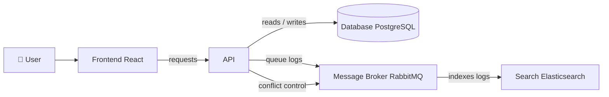
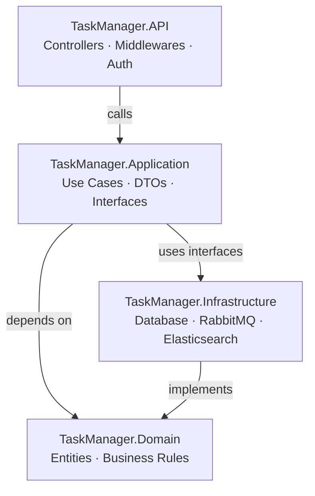

## Overview Architecture

This project follows a containerized microservice-friendly architecture where the **React frontend** communicates exclusively with the **API**, which then delegates to three specialized services: a relational database for persistence, a message broker for async processing, and a search engine for full-text capabilities.

| Service | Role |
|---|---|
| **Frontend** | React SPA served via Nginx |
| **API** | ASP.NET Core REST API, single entry point for all operations |
| **PostgreSQL** | Primary data store for tasks, users and all relational data |
| **RabbitMQ** | Handles two async flows: audit log queuing and concurrent edit conflict detection |
| **Elasticsearch** | Receives indexed logs from RabbitMQ for search and observability |

---

## Backend Layers

The backend follows **Clean Architecture** principles, ensuring the core business logic has zero dependency on frameworks or infrastructure. Dependencies always point inward — outer layers know about inner layers, never the reverse.

| Layer | Responsibility |
|---|---|
| **API** | HTTP entry point — routes requests, handles auth middleware and maps responses |
| **Application** | Orchestrates use cases, defines interfaces that infrastructure must implement |
| **Domain** | Pure business entities and rules — no frameworks, no external dependencies |
| **Infrastructure** | Concrete implementations of repositories, RabbitMQ publishers and Elasticsearch clients |

> **Why this matters:** swapping PostgreSQL for another database, or RabbitMQ for a different broker, only touches the `Infrastructure` layer — the domain and business logic remain completely unchanged.